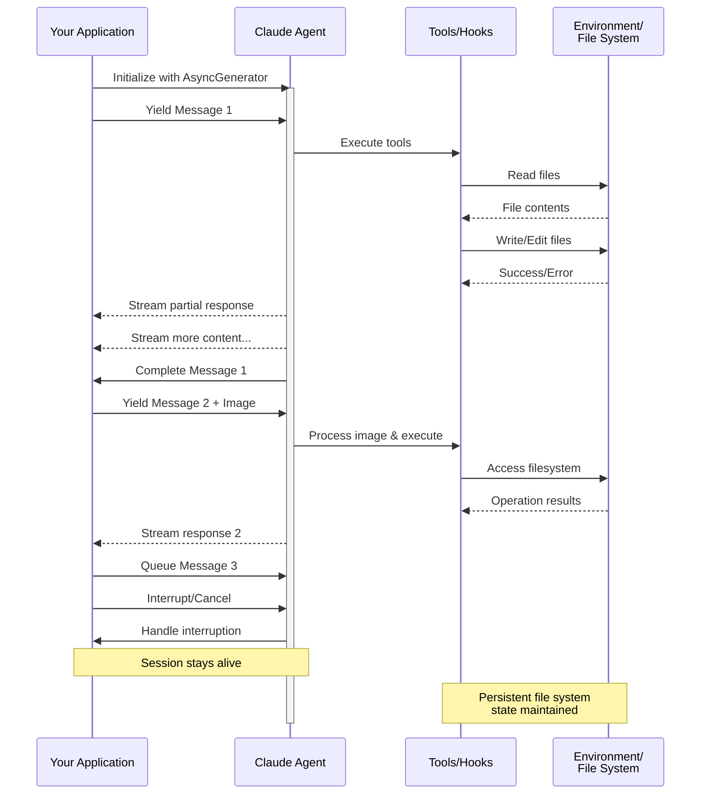

# 流式输入

> 理解 Claude Agent SDK 的两种输入模式及何时使用每种模式

<h2 id="overview">
  概述
</h2>

Claude Agent SDK 支持两种不同的输入模式来与代理交互：

* **流式输入模式**（默认和推荐）- 一个持久的、交互式的会话
* **单消息输入** - 使用会话状态和恢复的一次性查询

本指南解释了每种模式的差异、优势和用例，以帮助您为应用程序选择正确的方法。

<h2 id="streaming-input-mode-recommended">
  流式输入模式（推荐）
</h2>

流式输入模式是使用 Claude Agent SDK 的**首选**方式。它提供对代理功能的完全访问，并支持丰富的交互式体验。

它允许代理作为一个长期运行的进程运行，接收用户输入、处理中断、显示权限请求并处理会话管理。

<h3 id="how-it-works">
  工作原理
</h3>



<h3 id="benefits">
  优势
</h3>

<CardGroup cols={2}>
  <Card title="图像上传" icon="image">
    直接将图像附加到消息中以进行视觉分析和理解
  </Card>

  <Card title="队列消息" icon="stack">
    发送多条按顺序处理的消息，具有中断能力
  </Card>

  <Card title="工具集成" icon="wrench">
    在会话期间完全访问所有工具和自定义 MCP 服务器
  </Card>

  <Card title="实时反馈" icon="lightning">
    查看生成的响应，而不仅仅是最终结果
  </Card>

  <Card title="上下文持久性" icon="database">
    自然地跨多个回合维护对话上下文
  </Card>
</CardGroup>

<h3 id="implementation-example">
  实现示例
</h3>

<CodeGroup>
  ```typescript TypeScript theme={null}
  import { query, type SDKUserMessage } from "@anthropic-ai/claude-agent-sdk";
  import { readFile } from "fs/promises";

  async function* generateMessages(): AsyncGenerator<SDKUserMessage> {
    // First message
    yield {
      type: "user",
      message: {
        role: "user",
        content: "Analyze this codebase for security issues"
      },
      parent_tool_use_id: null
    };

    // Wait for conditions or user input
    await new Promise((resolve) => setTimeout(resolve, 2000));

    // Follow-up with image
    yield {
      type: "user",
      message: {
        role: "user",
        content: [
          {
            type: "text",
            text: "Review this architecture diagram"
          },
          {
            type: "image",
            source: {
              type: "base64",
              media_type: "image/png",
              data: await readFile("diagram.png", "base64")
            }
          }
        ]
      },
      parent_tool_use_id: null
    };
  }

  // Process streaming responses
  for await (const message of query({
    prompt: generateMessages(),
    options: {
      maxTurns: 10,
      allowedTools: ["Read", "Grep"]
    }
  })) {
    if (message.type === "result" && message.subtype === "success") {
      console.log(message.result);
    }
  }
  ```

  ```python Python theme={null}
  from claude_agent_sdk import (
      ClaudeSDKClient,
      ClaudeAgentOptions,
      AssistantMessage,
      TextBlock,
  )
  import asyncio
  import base64


  async def streaming_analysis():
      async def message_generator():
          # First message
          yield {
              "type": "user",
              "message": {
                  "role": "user",
                  "content": "Analyze this codebase for security issues",
              },
          }

          # Wait for conditions
          await asyncio.sleep(2)

          # Follow-up with image
          with open("diagram.png", "rb") as f:
              image_data = base64.b64encode(f.read()).decode()

          yield {
              "type": "user",
              "message": {
                  "role": "user",
                  "content": [
                      {"type": "text", "text": "Review this architecture diagram"},
                      {
                          "type": "image",
                          "source": {
                              "type": "base64",
                              "media_type": "image/png",
                              "data": image_data,
                          },
                      },
                  ],
              },
          }

      # Use ClaudeSDKClient for streaming input
      options = ClaudeAgentOptions(max_turns=10, allowed_tools=["Read", "Grep"])

      async with ClaudeSDKClient(options) as client:
          # Send streaming input
          await client.query(message_generator())

          # Process responses
          async for message in client.receive_response():
              if isinstance(message, AssistantMessage):
                  for block in message.content:
                      if isinstance(block, TextBlock):
                          print(block.text)


  asyncio.run(streaming_analysis())
  ```
</CodeGroup>

<Note>
  在 TypeScript SDK 中，如果您的消息生成器抛出异常，例如当它读取的文件丢失时，流会以一条错误消息结束，内容为 `Claude Code process aborted by user`，而不是原始错误，因此当您看到该消息时，请先检查生成器内部的代码。该错误前面可能还有一长行捆绑 SDK 源代码的缩小代码，因此请阅读输出末尾的错误文本。

  在 Python SDK 中，生成器异常在调试级别被记录，会话会停滞而不会引发异常，因此如果流式会话挂起且没有输出，请启用调试日志记录并检查您的生成器。
</Note>

<h2 id="single-message-input">
  单消息输入
</h2>

单消息输入更简单但功能更受限。

<h3 id="when-to-use-single-message-input">
  何时使用单消息输入
</h3>

在以下情况下使用单消息输入：

* 您需要一次性响应
* 您不需要图像附件或中间会话控制方法
* 您需要在无状态环境中运行，例如 lambda 函数

<h3 id="limitations">
  限制
</h3>

<Warning>
  单消息输入模式**不**支持：

  * 消息中的直接图像附件
  * 动态消息队列
  * 实时中断
  * 自然的多轮对话
</Warning>

如果查询以错误结果结束，例如 `error_max_turns`，单个消息 `query()` 调用会抛出一个错误，该错误包含在生成最终结果消息后的失败文本，因此如果您的代码需要继续，请将循环包装在 try 块中。有关结果子类型，请参阅[处理结果](/zh-CN/agent-sdk/agent-loop#handle-the-result)。

<h3 id="implementation-example-1">
  实现示例
</h3>

<CodeGroup>
  ```typescript TypeScript theme={null}
  import { query } from "@anthropic-ai/claude-agent-sdk";

  // Simple one-shot query
  for await (const message of query({
    prompt: "Explain the authentication flow",
    options: {
      maxTurns: 1,
      allowedTools: ["Read", "Grep"]
    }
  })) {
    if (message.type === "result" && message.subtype === "success") {
      console.log(message.result);
    }
  }

  // Continue conversation with session management
  for await (const message of query({
    prompt: "Now explain the authorization process",
    options: {
      continue: true,
      maxTurns: 1
    }
  })) {
    if (message.type === "result" && message.subtype === "success") {
      console.log(message.result);
    }
  }
  ```

  ```python Python theme={null}
  from claude_agent_sdk import query, ClaudeAgentOptions, ResultMessage
  import asyncio


  async def single_message_example():
      # Simple one-shot query using query() function
      async for message in query(
          prompt="Explain the authentication flow",
          options=ClaudeAgentOptions(max_turns=1, allowed_tools=["Read", "Grep"]),
      ):
          if isinstance(message, ResultMessage):
              print(message.result)

      # Continue conversation with session management
      async for message in query(
          prompt="Now explain the authorization process",
          options=ClaudeAgentOptions(continue_conversation=True, max_turns=1),
      ):
          if isinstance(message, ResultMessage):
              print(message.result)


  asyncio.run(single_message_example())
  ```
</CodeGroup>
